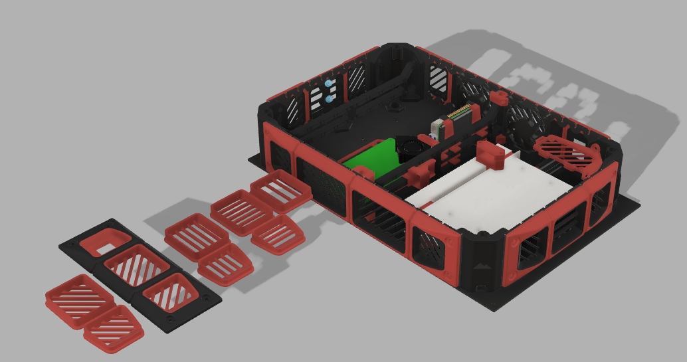
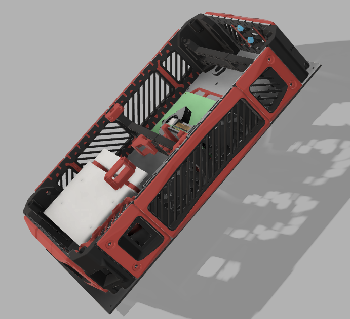

# RED BOX 
## Gasherbrum-K3 Custom Electronics Box

Based on [original Electronics_Box ](https://https://github.com/Annex-Engineering/Gasherbrum-K3/tree/main/Release_1_1/STLs/Electronics_Box/) 

### Аdded the following changes:

- Horizontal rails for equipment mounting and cable management
- Mounts for two power supplies LRS-200-48 and HUP-200-24
- Mounts for SSR (Crydom ED24C5)
- Mount for power relay BIGTREETECH-Relay-V1.2
- Mount for MCU like this https://aliexpress.ru/item/1005003572003721.html
- Changed the design of some panels
- Case side panels now have a structural design

The source CAD are included, You can make any changes you want.

_Special thanks to Vladlen Borovikov (discord: v_b#2674), the idea and design of the two-color panels is completely his. Special thanks to the local community of users of Annexes and VORON in Russia._